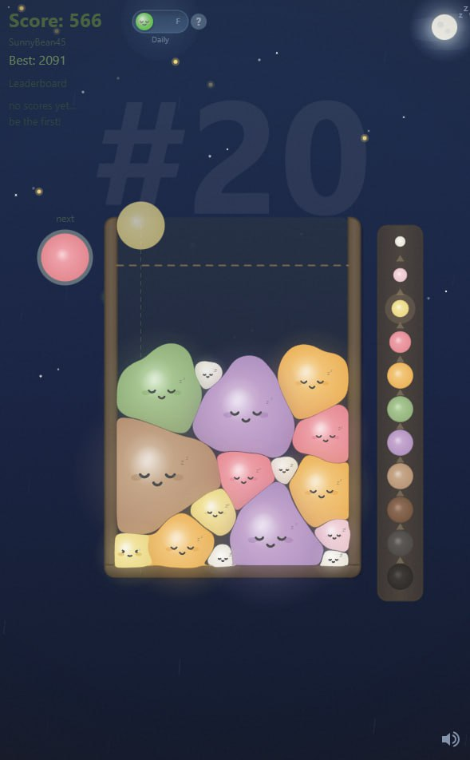
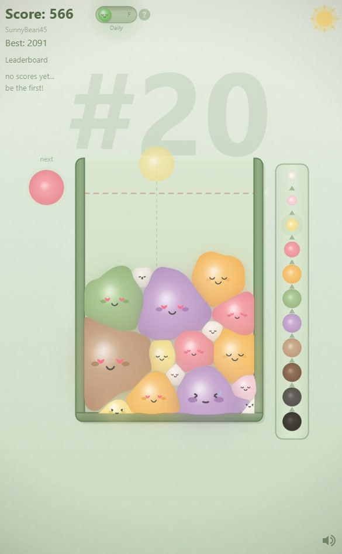

# 🍡 Mochii

> *What happens when mochi meets Suika? Chaos. Delicious, squishy chaos.*

A physics-based puzzle game where you drop adorable mochi and watch them squish, bounce, and merge into bigger, cuter mochi. It's like Suika Game, but softer.

<p align="center">
  
  
</p>

## 🎮 Play Now

**[mochii.dev](https://mochii.dev)**

## ✨ Features

- 🌙 **Day/Night Cycle** — Watch your mochi vibe under stars or sunshine
- 🧠 **Daily Challenge** — Same seed for everyone, compete globally
- 🏆 **Leaderboards** — Separate rankings for daily & freeplay modes
- 😊 **Expressive Mochi** — They squish, smile, and make heart eyes
- 🐱 **Easter Eggs** — Keep an eye out for wandering cats and cherry blossoms
- 📱 **Mobile Ready** — Squish mochi on the go
- ⚡ **Buttery Smooth** — Web Worker physics for that 60fps goodness

## 🎯 How to Play

1. **Drop** mochi into the container
2. **Match** same-tier mochi to merge them
3. **Grow** your mochi to reach higher tiers
4. **Don't overflow** — if mochi spill over the line, it's game over!

## 🍡 The Mochi Tiers

Merge matching mochi to climb the tiers — can you reach the legendary final form?

| Tier | Size | Color |
|------|------|-------|
| 1 | Tiny | 🤍 White |
| 2 | Small | 💗 Pink |
| 3 | Medium | 💜 Purple |
| 4 | Large | 💛 Yellow |
| 5 | Bigger | 🧡 Orange |
| 6 | Big | 💚 Green |
| 7+ | *Huge* | 🤎 *Keep merging...* |

## 🛠️ Tech Stack

- **[Astro](https://astro.build)** — Static site generation
- **TypeScript** — Type-safe mochi physics
- **Canvas API** — Hand-crafted rendering
- **Web Workers** — Off-thread physics simulation
- **[Supabase](https://supabase.com)** — Leaderboard & daily challenges

## 🏗️ Development

```bash
# Install dependencies
pnpm install

# Start dev server
pnpm dev

# Build for production
pnpm build
```

## 🤝 Contributing

Found a bug? Got a feature idea? Want to add a new mochi expression?

Open an issue or PR — all contributions welcome!

## 📜 License

MIT — go forth and make mochi games

---

<p align="center">
  Made with 🍡 by <a href="https://github.com/1-Felix">Felix</a>
</p>
